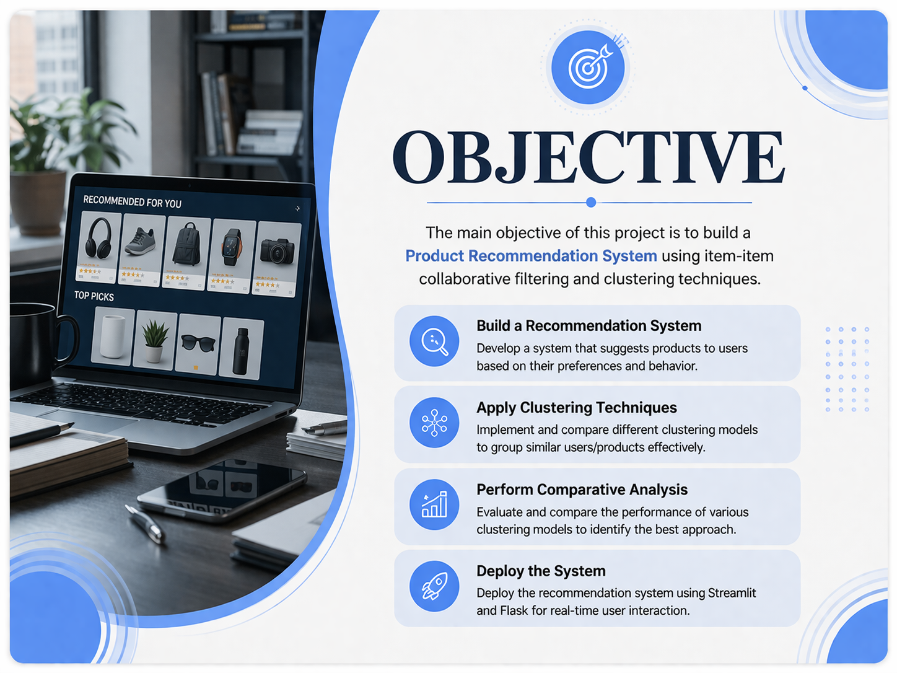
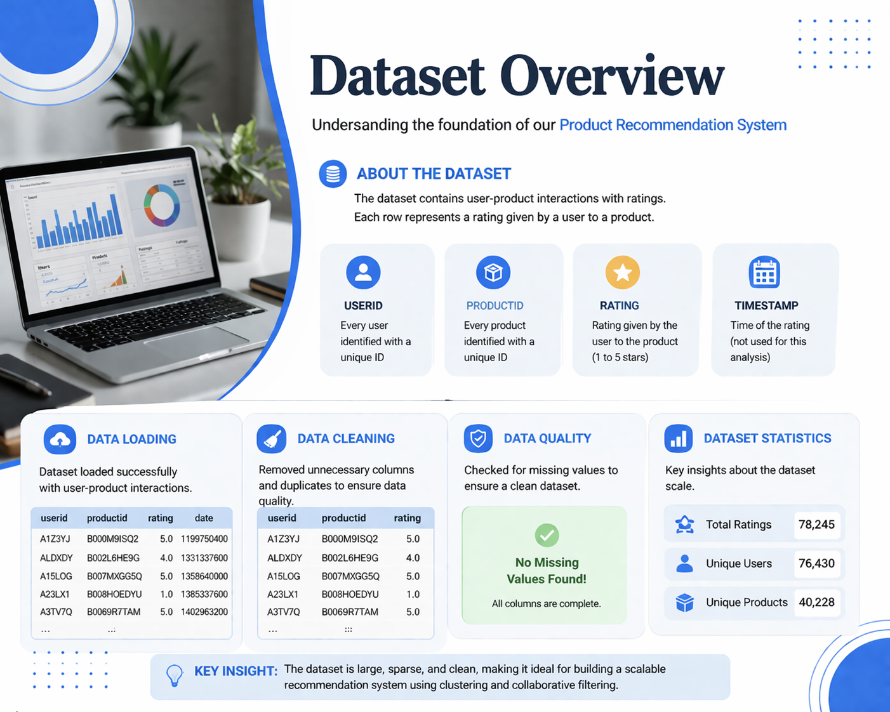
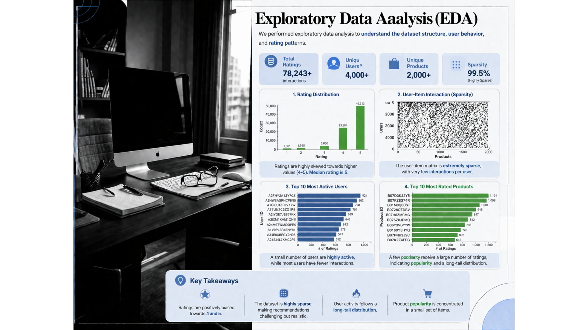
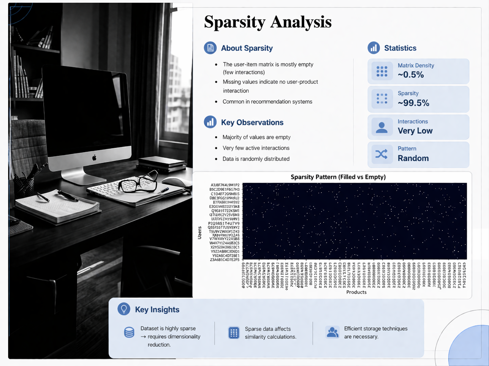

# Product-Recommendation-System
## 📌 Overview
This project builds a recommendation system using item-item collaborative filtering ,clustering and similarity techniques.

## ⚙️ Features
- User clustering using K-Means
- Item-based recommendation
- Handles cold start problem

## 🛠 Tech Stack
- Python
- Pandas
- Scikit-learn
- NumPy

## 📂 Files
- app.py → Main application
- Project_FINAL.ipynb → Model building
- rating_short.csv → Dataset
- .pkl files → Saved models

## ▶️ How to Run
```bash
pip install -r requirements.txt
python app.py

## 📸 Project Screenshots

### Project Name
![Project]

### Project Objective


### Dataset Overview


### Exploratory Data Analysis


### Sparsity Check

